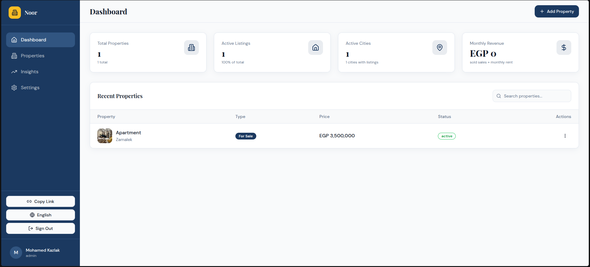
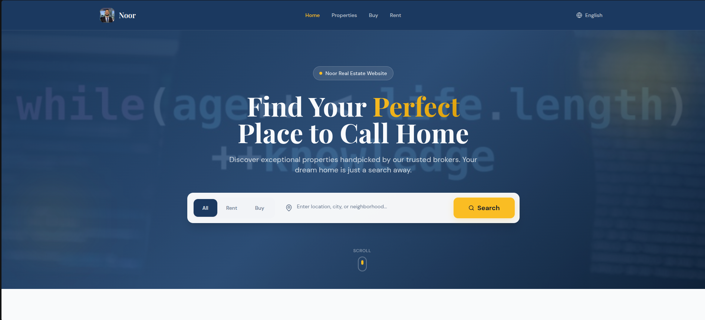
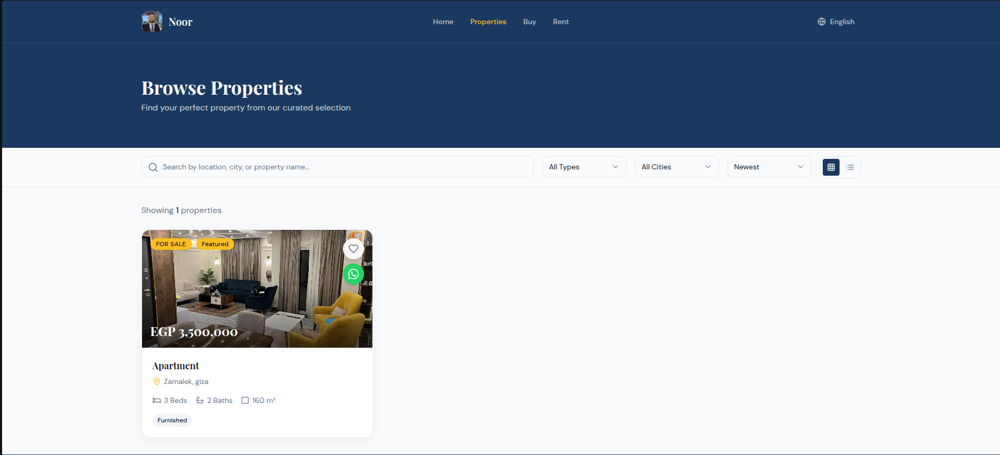
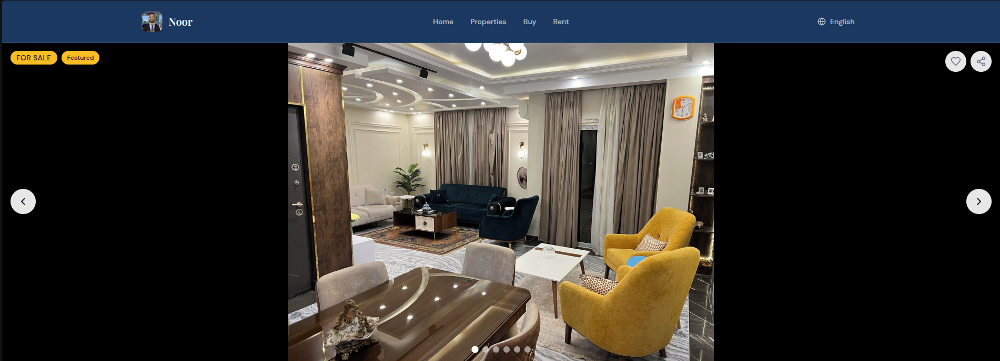
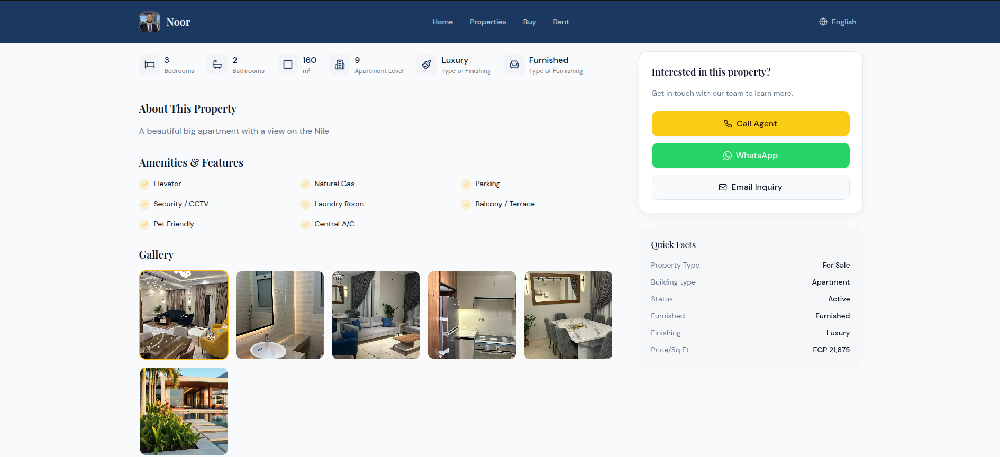

# Broker Platform

Welcome to the **Broker Platform Main** repository! This is a complete, multi-tenant platform tailored for real estate brokers to manage listings, analyze insights, and host customized white-labeled consumer-facing websites under their own subdomains.

## Key Features

- **Broker Dashboard:** A comprehensive central hub to track property statuses, sales volume, top locations, and message handling.
- **Custom Broker Subdomains:** Automatically handles multi-tenant subdomains so each broker gets a unique real estate website (e.g. `brokername.localhost` acting as their portfolio).
- **Property Management:** Dedicated pages and workflows to add, update, rent, or sell properties with rich descriptions, specs, and images.
- **Dynamic Content & Theming:** Custom tenant-facing landing pages show personalized hero backgrounds, broker details, and curated property lists based on active subscriptions.
- **Analytics & Insights:** Granular reporting metrics built directly into the broker dashboards.
- **Arabic Localization (i18n):** Full Arabic language support across the dashboard, home, pricing, property, and tenant-facing pages with right-to-left (RTL) layout handling for a native Arabic browsing experience.

## Project Screenshots

Here are previews of the platform to give you an idea of the polished UI and user experience:

### 1. Landing Page


### 2. Broker Dashboard



### 3. Broker's Page



### 4. Browse Properties



### 5. Property Details



### 6. Property Details



## Tech Stack

- **Frontend:** React, Vite, Tailwind CSS, shadcn/ui, TypeScript
- **Backend/API:** Node.js, Express (with Subdomain routing middleware)
- **Database / Auth:** Supabase PostgreSQL & Authentication
- **Payments:** Stripe / PayPal Modules Placeholder

## Quick Start Guide

**Prerequisites:** Ensure you have Node.js and npm installed. Check that your Supabase environment variables are correctly configured.

1. **Clone the repository:**

   ```bash
   git clone https://github.com/Mohamedkazlak/Broker-Platform
   cd "Broker Platform Main"
   ```

2. **Install dependencies:**
   Make sure you install all module dependencies at the root and optionally within client/server folders.

   ```bash
   npm install
   cd client && npm install
   cd ../server && npm install
   ```

3. **Start the Development Environments:**
   You will typically need to run both client and server simultaneously for the platform to function properly.

   ```bash
   npm run dev:all
   ```

> [!TIP]
> Ensure you have a root `.env` configured (see `.env.example` for required variables: Supabase keys, server URL, etc.).
